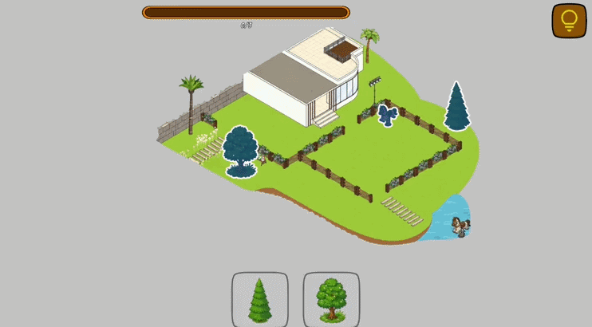
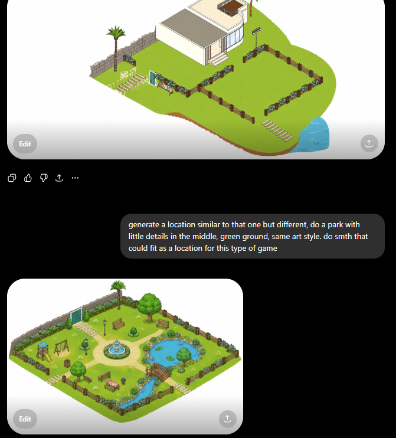

# Drag & Drop Puzzle Test Task

## Overview
A small mobile 2D children's puzzle game prototype.
The player is presented with a colorful scene containing missing objects. Missing objects appear as silhouettes on the scene, while the corresponding pieces are shown in a collection at the bottom of the screen. The player drags pieces onto the correct silhouettes. Correctly placed pieces snap into position and become part of the scene. When all pieces are placed, the level is completed and the next level is loaded.
The project contains multiple levels, hint functionality, progress tracking, sound feedback and simple visual effects.

Files : https://drive.google.com/drive/folders/1IpeqlIx0vhV6O1kVhgSU34degKYbKSSm?usp=sharing

## Time Spent
6-8 hours.

## AI Workflow

### Planning
Initial gameplay analysis and task breakdown were done with ChatGPT.
Architecture planning, implementation approach, feature prioritization and scope decisions were done partly with ChatGPT and mostly manually.

### Art Generation
Art was generated using ChatGPT image generation.

Workflow:
- Took screenshots from the provided reference game.
- Used ChatGPT to remove backgrounds and generate similar environments.
- Generated individual objects matching the visual style of the environments.
- Prepared generated assets and integrated them into the game.

### Code Generation
Core architecture, gameplay systems and implementation directions were designed manually.
Windsurf (Cascade) was used as a coding assistant for:
- Generating initial implementations.
- Filling out boilerplate code.
- Refactoring UI-related code.
- Fixing implementation bugs after receiving detailed instructions.
- Assisting with dependency injection setup and project configuration.

Generated code was reviewed, tested, rewritten and adjusted manually where necessary.
AI was treated as an implementation assistant rather than an autonomous developer.

### Example AI Prompts

#### Gameplay Implementation
"I am working on a test task game and need to implement it quickly with a simple architecture.

Mobile 2D children's puzzle game.

The screen displays a large colorful scene with several empty silhouettes representing missing objects (SettableItem). At the bottom of the screen there is a collection of puzzle pieces mixed in random order (HandItemsView).

The player can drag any puzzle piece (ItemsManager). While dragging, the piece follows the pointer (DraggableItem). If the piece is released close enough to its correct slot, it snaps into place, becomes fixed, and can no longer be moved. If released anywhere else, it smoothly returns to its original position.

When a puzzle piece is correctly placed, a small success effect and sound are played. Use a simple ParticleSystem effect player and AudioManager for sound playback.

The goal is to place all puzzle pieces into their matching slots and complete the scene.

Additionally, analyze the BallDrop namespace from another project and use it only as a reference for implementation patterns.
"

#### Refactoring & Bug Fixing
"fix
1 currently it works like this : item click - then start dragging, meaning player needs to first click on the @HandItemView , get pointer up, then it starts "setting item" so player needs to pointer down and then drag the item, while the flow should be - player PointerDown on the item, @DraggableItem  appears WHERE PLAYER FINGER IS and player is now dragging

2 item on pointer down not found settable target moves to vector2 zero using bad dotween animation, make it move to the hand item where it was taken from (first make the HandItemsView send the position in ui space, then itemsManager needs to find that position in worldSpace and move there and constantly moving there OnUpdate of dotween specifically there, like it was dropped with a little animation)

3 currently (@DraggableItem , @ItemsManager ) on snap does work, but wrong. on snap it needs to GRADUUALLY MOVE LIKE ITS GETTING MAGNET TO THE PLACE OF SETTABLE TARGET, it gets there and stays, no matter how much player is dragging around, until player DRAGS OUT FROM THE OFFSET OF THE SNAPPING - then it immediately unsnaps and gets to the player pointer / dragging position

4 after setting the item (@ItemsManager ) - cant choose the next items, its completely blocked

5 @ProgressIndicator  needs to proerply set the progress fill image from 0 - 1"

#### Configuration Review
"analyze the project and identify values that should be moved from serialized fields or hardcoded values into @GameConfig"

### Testing
The project was manually tested for:
- Correct piece placement.
- Incorrect piece placement.
- Snap behavior.
- Drag and drop flow.
- Hint functionality.
- Progress updates.
- Level completion.
- Level transitions.
- Multiple level configurations.
- Basic mobile portrait gameplay.

Issues found during testing were fixed through several implementation and balancing iterations.

## Tech Stack
- Unity
- C#
- DOTween
- Zenject
- ChatGPT
- Windsurf (Cascade)